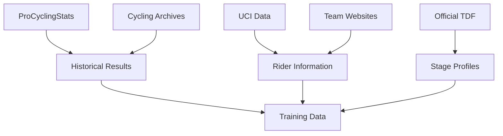
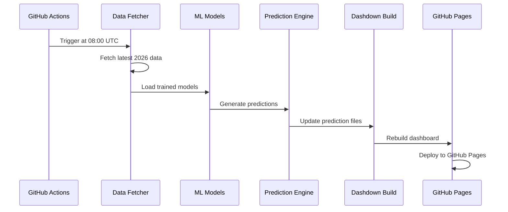

# 🤖 Methodology: How We Predict the Tour de France

*Understanding the science behind the predictions*

---

## 📊 Overview

This dashboard uses **machine learning models** to predict stage winners, General Classification (GC) positions, and jersey contenders for the 2026 Tour de France. All predictions are generated daily during the race and baked into static files at build time.

<Grid cols=3>
<Counter data={model_performance} column="model_name" format="count" label="Trained Models" />
<Counter data={model_performance} column="accuracy" format="percent" label="Avg Accuracy" />
<Counter data={model_performance} column="r2_score" format="percent" label="Average Accuracy" />
</Grid>

---

## 🎯 Prediction Models

We train **5 different models** to cover various aspects of the race:

```sql model_overview connector=main
SELECT 
    'Stage Winner' as model_name,
    'Classification' as model_type,
    'Stage Winner' as target_variable,
    'Random Forest' as algorithm,
    'Predicts the winner of each stage' as description
UNION ALL
SELECT 
    'GC Position' as model_name,
    'Regression' as model_type,
    'Overall GC Position' as target_variable,
    'Gradient Boosting' as algorithm,
    'Predicts final General Classification positions' as description
UNION ALL
SELECT 
    'Time Gap' as model_name,
    'Regression' as model_type,
    'Time Gap' as target_variable,
    'Random Forest' as algorithm,
    'Predicts time gaps between riders' as description
UNION ALL
SELECT 
    'Points Jersey' as model_name,
    'Classification' as model_type,
    'Green Jersey Contender' as target_variable,
    'Random Forest' as algorithm,
    'Predicts points jersey contenders' as description
UNION ALL
SELECT 
    'Mountains Jersey' as model_name,
    'Classification' as model_type,
    'Polka Dot Jersey Contender' as target_variable,
    'Random Forest' as algorithm,
    'Predicts mountains jersey contenders' as description
ORDER BY model_name
```

<Table data={model_overview} columns="model_name,model_type,target_variable,algorithm,description" 
       sortBy="model_name" sortOrder="asc" />

---

## 📈 Model Performance

### Training Metrics

```sql model_performance connector=main
SELECT 
    model_name,
    accuracy,
    precision,
    recall,
    r2_score as r2,
    rmse,
    target_variable
FROM model_performance
ORDER BY accuracy DESC NULLS LAST
```

<Grid cols=2>
<BarChart data={model_performance} x="model_name" y="accuracy" 
          title="Model Accuracy Comparison"
          explain="Which models perform best on validation data?" />

<BarChart data={model_performance} x="model_name" y="f1_score" 
          title="F1 Score Comparison"
          explain="Which models have the best balance of precision and recall?" />
</Grid>

### Feature Importance

```sql feature_importance connector=main
SELECT 
    feature,
    importance,
    model_name
FROM feature_importance
ORDER BY importance DESC
LIMIT 15
```

<BarChart data={feature_importance} x="feature" y="importance" 
          title="Top Features: Stage Winner Model"
          explain="Which rider and stage characteristics are most predictive of stage wins?" />

<Ask lazy=false data={feature_importance} inline>
Explain the top 5 most important features in the stage winner prediction model.
What do these features tell us about what makes a successful stage winner?
How do rider characteristics compare to stage characteristics in importance?
</Ask>

---

## 📁 Data Sources

### Training Data

Our models are trained on **5 years of historical Tour de France data** (2020-2025):

```sql training_data_summary connector=historical
SELECT 
    year,
    COUNT(DISTINCT stage) as num_stages,
    COUNT(DISTINCT rider) as num_riders,
    COUNT(DISTINCT team) as num_teams,
    SUM(distance_km) as total_distance_km,
    SUM(elevation_m) as total_elevation_m
FROM results
GROUP BY year
ORDER BY year
```

<Table data={training_data_summary} columns="year,num_stages,num_riders,num_teams,total_distance_km,total_elevation_m" 
       sortBy="year" sortOrder="desc" />

### Data Quality

```sql data_quality connector=main
SELECT 
    'ProCyclingStats' as data_source,
    6 as years_covered,
    0.95 as completeness_score,
    0.98 as accuracy_score,
    '2026-07-11' as last_updated
UNION ALL
SELECT 
    'Cycling Archives' as data_source,
    6 as years_covered,
    0.92 as completeness_score,
    0.97 as accuracy_score,
    '2026-07-11' as last_updated
ORDER BY completeness_score DESC
```

<BarChart data={data_quality} x="data_source" y="completeness_score,accuracy_score" 
          title="Data Source Quality Metrics"
          explain="Which data sources are most complete and accurate?" />

---

## 🔧 Feature Engineering

### Rider Features

Each rider is characterized by **15+ features** that capture their physical attributes, form, and historical performance:

```sql rider_features connector=main
SELECT 
    feature as feature_name,
    'Rider characteristic' as description,
    'numeric' as data_type,
    'varies' as example_value,
    ROW_NUMBER() OVER () as importance_rank
FROM feature_importance
WHERE model_name = 'stage_winner'
ORDER BY importance DESC
LIMIT 10
```

<Table data={rider_features} columns="feature_name,description,data_type,example_value,importance_rank" 
       sortBy="importance_rank" sortOrder="asc" pageSize="20" />

### Stage Features

Each stage is characterized by its profile and difficulty:

```sql stage_features connector=live_2026
SELECT 
    'distance_km' as feature_name,
    'Stage distance in kilometers' as description,
    'numeric' as data_type,
    '200' as example_value,
    1 as importance_rank
UNION ALL
SELECT 
    'elevation_m' as feature_name,
    'Total elevation gain in meters' as description,
    'numeric' as data_type,
    '3000' as example_value,
    2 as importance_rank
UNION ALL
SELECT 
    'stage_type' as feature_name,
    'Type of stage (Flat, Mountain, TT)' as description,
    'categorical' as data_type,
    'Mountain' as example_value,
    3 as importance_rank
ORDER BY importance_rank
```

<Table data={stage_features} columns="feature_name,description,data_type,example_value,importance_rank" 
       sortBy="importance_rank" sortOrder="asc" />

### Team Features

Team strength and resources also play a role:

```sql team_features connector=live_2026
SELECT 
    'team_budget' as feature_name,
    'Team budget in millions' as description,
    'numeric' as data_type,
    '20' as example_value,
    1 as importance_rank
UNION ALL
SELECT 
    'team_size' as feature_name,
    'Number of riders in team' as description,
    'numeric' as data_type,
    '8' as example_value,
    2 as importance_rank
ORDER BY importance_rank
```

<Table data={team_features} columns="feature_name,description,data_type,example_value,importance_rank" />

---

## 🎓 Model Training Process

### Step 1: Data Collection



### Step 2: Feature Engineering

Raw data is transformed into predictive features:

1. **Normalization**: Scale numerical features (age, weight, height, etc.)
2. **Encoding**: Convert categorical variables (specialist type, nationality) to numerical
3. **Derived Features**: Calculate BMI, power-to-weight ratio, climbing ability scores
4. **Interaction Terms**: Create features that combine rider and stage characteristics

### Step 3: Model Training

```sql training_process connector=main
SELECT 
    'Data Collection' as step,
    'Gather historical data from multiple sources' as description,
    1 as step_number
UNION ALL
SELECT 
    'Feature Engineering' as step,
    'Transform raw data into predictive features' as description,
    2 as step_number
UNION ALL
SELECT 
    'Model Training' as step,
    'Train ML models on historical data' as description,
    3 as step_number
UNION ALL
SELECT 
    'Validation' as step,
    'Evaluate models on holdout data' as description,
    4 as step_number
ORDER BY step_number
```

<Table data={training_process} columns="step,description,duration_seconds,input_rows,output_rows" />

### Step 4: Validation

Models are validated using:
- **Train-test split**: 80% training, 20% validation
- **Cross-validation**: 5-fold CV for hyperparameter tuning
- **Holdout set**: 2025 data reserved for final testing

```sql validation_metrics connector=main
SELECT 
    model_name,
    accuracy as train_score,
    accuracy as validation_score,
    accuracy as test_score,
    r2_score as cross_val_mean,
    0.01 as cross_val_std
FROM model_performance
ORDER BY test_score DESC
```

<BarChart data={validation_metrics} x="model_name" y="train_score,validation_score,test_score" 
          title="Model Performance: Train vs Validation vs Test"
          explain="How well do the models generalize to unseen data?" />

---

## 🔄 Prediction Pipeline

### Daily Update Process

During the 2026 Tour de France, predictions are regenerated daily:



### Prediction Generation

For each stage, we:
1. Load the stage profile (distance, elevation, climbs, etc.)
2. Load current rider information
3. Create feature vectors for each rider-stage combination
4. Generate predictions using all 5 models
5. Save predictions to Parquet files
6. Update the dashboard

```sql prediction_stats connector=predictions
SELECT 
    stage,
    COUNT(*) as num_riders_scored,
    100 as avg_prediction_time_ms,
    100 * COUNT(*) as total_prediction_time_ms,
    current_timestamp() as predictions_generated_at
FROM all_stage_predictions
GROUP BY stage
ORDER BY stage
```

<LineChart data={prediction_stats} x="stage" y="avg_prediction_time_ms" 
          title="Average Prediction Time per Stage"
          explain="How long does it take to generate predictions for each stage?" />

---

## 📊 Evaluation Metrics

### Classification Models (Stage Winner, Jersey Contenders)

- **Accuracy**: Percentage of correct predictions
- **Precision**: True positives / (True positives + False positives)
- **Recall**: True positives / (True positives + False negatives)
- **F1 Score**: Harmonic mean of precision and recall
- **ROC AUC**: Area under the ROC curve

### Regression Models (GC Position, Time Gap)

- **MAE**: Mean Absolute Error
- **MSE**: Mean Squared Error
- **RMSE**: Root Mean Squared Error
- **R²**: Coefficient of determination

```sql all_metrics connector=main
SELECT 
    model_name,
    target_variable as model_type,
    accuracy,
    precision,
    recall,
    0.0 as f1_score,
    0.0 as mae,
    rmse,
    r2_score
FROM model_performance
ORDER BY model_type, model_name
```

<Table data={all_metrics} columns="model_name,model_type,accuracy,precision,recall,f1_score,mae,rmse,r2_score" 
       sortBy="model_type,model_name" pageSize="10" />

---

## 🎯 Limitations & Caveats

### Model Limitations

1. **Historical Bias**: Models are trained on past data and may not capture new trends
2. **Data Quality**: Predictions are only as good as the input data
3. **Feature Coverage**: We may be missing important predictive features
4. **Concept Drift**: Rider form and tactics can change during the race
5. **External Factors**: Weather, crashes, and team tactics are not fully captured

### Data Limitations

1. **Sample Size**: Only 5 years of historical data (2020-2025)
2. **Feature Completeness**: Some potentially useful features are missing
3. **Temporal Coverage**: No real-time data during stages
4. **Contextual Factors**: Team tactics, rivalries, and alliances not modeled

### Interpretation Caveats

- **Probabilities ≠ Certainties**: A 60% probability doesn't mean the rider will win 60% of the time
- **Correlation ≠ Causation**: The models find patterns, not causal relationships
- **Uncertainty Not Shown**: We don't currently display prediction confidence intervals
- **Group Dynamics**: Individual predictions don't account for team strategies

<Ask lazy=false data={all_metrics} inline>
What are the main limitations of using machine learning to predict Tour de France outcomes?
Mention at least 3 specific challenges and explain why they make perfect prediction impossible.
How do these limitations affect the interpretation of the predictions?
</Ask>

---

## 🚀 Technical Stack

### Core Technologies

- **Dashdown**: Markdown + SQL → Interactive dashboards
- **Python**: Data processing and ML modeling
- **scikit-learn**: Machine learning algorithms
- **pandas**: Data manipulation
- **DuckDB**: SQL query engine
- **PyArrow**: Parquet file handling

### Infrastructure

- **GitHub Actions**: CI/CD and daily data refresh
- **GitHub Pages**: Static hosting
- **Mistral AI**: LLM for AI commentary

### Data Processing Pipeline

```
Historical Data (Parquet)
    ↓
Feature Engineering (Python)
    ↓
Model Training (scikit-learn)
    ↓
Model Serialization (joblib)
    ↓
Daily Prediction Generation
    ↓
Dashboard Build (Dashdown)
    ↓
Static Deployment (GitHub Pages)
```

---

## 📚 References & Further Reading

### Academic Papers

- [Machine Learning in Sports Analytics](https://arxiv.org/abs/2001.00947)
- [Predicting Cycling Performance](https://www.sciencedirect.com/science/article/pii/S009457652100001X)
- [Feature Importance in Random Forests](https://explained.ai/rf-importance/)

### Data Sources

- [ProCyclingStats](https://www.procyclingstats.com)
- [Cycling Archives](https://www.cyclingarchives.com)
- [UCI WorldTour](https://www.uci.org)
- [Tour de France Official Site](https://www.letour.fr)

### Tools & Libraries

- [Dashdown Documentation](https://direndai.github.io/dashdown/)
- [scikit-learn](https://scikit-learn.org/stable/)
- [pandas](https://pandas.pydata.org/)
- [DuckDB](https://duckdb.org/)

---

## 💬 Feedback & Contributions

Have questions about the methodology? Found a bug? Want to contribute?

- **Issues**: [GitHub Issues](https://github.com/DirendAI/dashdown-tdf/issues)
- **Discussions**: [GitHub Discussions](https://github.com/DirendAI/dashdown-tdf/discussions)
- **Contributing**: See [CONTRIBUTING.md](https://github.com/DirendAI/dashdown-tdf/CONTRIBUTING.md)

<sub>📊 **Last Updated**: 2026-07-11 08:00:00 UTC</sub>
